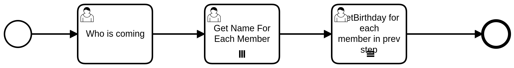

Concepts, Example Code,and Digrams
==================================

Example Code
------------

This is the example code for running the workflow. The first thing that you will need to do is make sure that the
following files are imported ::

    from SpiffWorkflow.bpmn.workflow import BpmnWorkflow
    from SpiffWorkflow.camunda.parser.CamundaParser import CamundaParser
    from SpiffWorkflow.camunda.specs.UserTask import EnumFormField, UserTask

In the code below we have first specialized parse that parsers the Camunda file
we then add the file (bpmn) in, that we just parsed. Lastly for this chunck we are getting a specification, it is loading
all the files from the and has complied it down ::

    x = CamundaParser()
    x.add_bpmn_file('Basicexample.bpmn')
    spec = x.get_spec('BasicExample')

On this line below we are calling BPMNworkflow(spec), this is creating instances of that workflow. Meaning that it is a running
working workflow, this allows for the state to be known, such as where you are and what current tasks needs to be completed. ::

    workflow = BpmnWorkflow(spec)

On the line bellow you are running .do_engine_steps(): This allows you to do things that are automatic. For example if
you have script task that need to run at the start event it will go through and do all the automatic task that are
already there. The code after that on other hands calls for all task, and gets it ready to run all tasks. Including
getting parallele tasks ready to run ::

    workflow.do_engine_steps()
    ready_tasks = workflow.get_ready_user_tasks()

In these last few lines our code is running through the workflow and seeing where there are task that have a Usertask
then it will show form and print out the data from that task. (look at example bellow to see what printed questions
look like and what the data at the end looks like.) ::

    while len(ready_tasks) > 0:
        for task in ready_tasks:
            if isinstance(task.task_spec, UserTask):
               show_form(task)
               print(task.data)
            else:
                print("Complete Task ", task.task_spec.name)
            workflow.complete_task_from_id(task.id)

All below examples will use the same code

There is also a funcation at the top of the Example Code file that allows for the form to ask the user the quations
that are filled out in the form section, ask for an mput and updata the insfomation as the workflow is working through
the procces. ::

    def show_form(task):
        model = {}
        form = task.task_spec.form

        if task.data is None:
            task.data = {}

        for field in form.fields:
            prompt = field.label
            if isinstance(field, EnumFormField):
                prompt += "? (Options: " + ', '.join([str(option.id) for option in field.options]) + ")"
            prompt += "? "
            answer = input(prompt)
            if field.type == "long":
                answer = int(answer)
            task.update_data_var(field.id,answer)

Basic Example:
--------------
In this example you are doing one of the most simple versions of a BPMN workflow. We have a start event, an activity
with a UserTask, and an end event. When the user task activity box is clicked there are forms that you can fill to ask
questions. In this flow the user is answering two questions : Where are they going and do they like spam. Below you will
find what the user is being prompted to answer and how the data is being stored in the dictionary.

.. image:: images/basic_example.png

.. image:: images/basic_example_output.png

When making the BPM and assigning the activity with a UserTask you then have the option to fill out a form which will (with
the show form function), promote and ask the sure to complete the questions and collect the data. The form in the image
below is the same form that is used to create the example above.  In this form you are first asked to enter a form key
which identifies the name of the form. Then you can add form fields. So here we have added location, below we have added
the different components that need to be in this form field, first with the id-the name of the variable, then the type
in this case and enum. Next we need to have a label, this is the Information that will be displayed to the user.
Followed by values, it is recommended that you add a default value just in case the user does not input a variable
that is recognized. And with all that you have the basics that you need to get the form up and working.

.. image:: images/basic_example_form.png

Exclusive Gateway Example:
--------------------------
An exclusive gateway is used to express that exactly one alternative can be selected. In an exclusive gateway, the
token runs along the sequence flow whose condition is met first. The response you get depends on which one path that
you chose to take. For example looking at the BPMN and output you can see that the path that is taken depends on the
response to the “Do you like spam?” question in the user task previous. If you answered no you will be asked for ONLY
bad spam brands, if you answered yes you will be asked ONLY good spam brands.

.. image:: images/exgateway.png

.. image:: images/exgateway-output.png

Parallel Gateway Example:
-------------------------
A parallel or AND gateway creates parallel paths without checking any conditions. This means that each outgoing sequence
flow becomes active upon the execution of a parallel gateway, which is commonly known as a “process fork”. Let's look
at the example below, unlike in the previous example of exclusive gateways, you will be promoted to answer questions
in regards to both good AND bad brands.

.. image:: images/plgateway.png

.. image:: images/plgateway-output.png

Script Example:
-----------------
 A Script Task is executed by a business process engine. In our example it's the .do_engine_steps(). The modeler (for us
it will be Camandu) or implementer defines a script in a language that the engine can interpret, we will be using python.
When the Task is ready to start, the engine will execute the script. When the script is completed, the Task will also be
completed. These are easy to use when a task can easily be performed automatically.

.. image:: images/Scriptsexample.png
.. image:: images/Scriptsexample-output.png

Dmn and Decision Table Example:
--------------------------------
In DMN, decisions can be modeled and executed using the same language. Business analysts can model the rules that lead
to a decision in an easy to read table, and those tables can be executed directly by a decision engine (like Camunda).
This minimizes the risk of misunderstandings between business analysts and developers, and it even allows rapid changes
in production. Yes we can do a lot of the things we do with DMN using BPMN gateways but it creates complicated and very
disorganized BPMN allowing for mistakes and confusions. BPMN includes a business rule task, which is the decision table.
That task refers to a decision that needs to be made, and the outcome of the decision that is made based on the table
allows for the next gateway or activity to route the flow.

Let's first look at the BPMN image below we are building on the basic example. Here we have an activity with the
business tasks that reads Make a decision this is where the table is rooted and called on the BPMN side.

.. image:: images/decision_table.png

Now let's look at the DMN table:
    -The column second from the left refers to possible input data. In this example,
    there is only one input column. The cell with the text “Location” defines what the input is. In DMN, this is the label
    for an input expression. The cells below called input entries refer to the possible conditions regarding the input.
    Those conditions are in quotation marks (like “cabin”), which is because we are technically comparing String values.
    -For each possible input entry, we define the according output entry in the cell next to it. That’s how we express
    that based on the location, how you must bring your Spam. Again, we have to use quotation marks because technically
    we are assigning String values.
    -Last but not least, you can annotate your rules in the column on the right.
    Those annotations are only there for you to explain and are not seen by anyone else, and will be ignored by a decision engine.

.. image:: images/dmn.png

Lastly you can see an example of what is happening in the output image below.

.. image:: images/dmn-output.png

Multi-Instance Example:
-------------------------
Multi-instance activities are represented by three horizontal or vertical lines at the bottom-center of the activity
and task symbol. It’s purpose is to show that the activity occurs for a collection of objects or items.  The number of
times that the activity completes is defined by the number of items that exist in the collection. This is different from
other looping mechanisms that must check a condition every time the loop completes in order to determine if it should
continue looping. Three vertical lines indicate that the multi-instance activity is non-sequential.  This means that the
activity can be completed for each item in the collection in no particular order. Three horizontal lines indicate that
the multi-instance activity is sequential. This means that the activity must complete for each item in the order that
they are received within the collection.

Let's look at the example below, the first activity is a UserTask which allows us to ask how many people are going on
this trip. We are then going to use that number to go through the multi-instance. The first is non-sequential, which
means that you can add the names in any order. Then in the next activity the multi-instance in sequential and will go
through the names in the order they were received. This can more easily be seen through the output image.

.. image:: images/multi_instance_array-output.png

